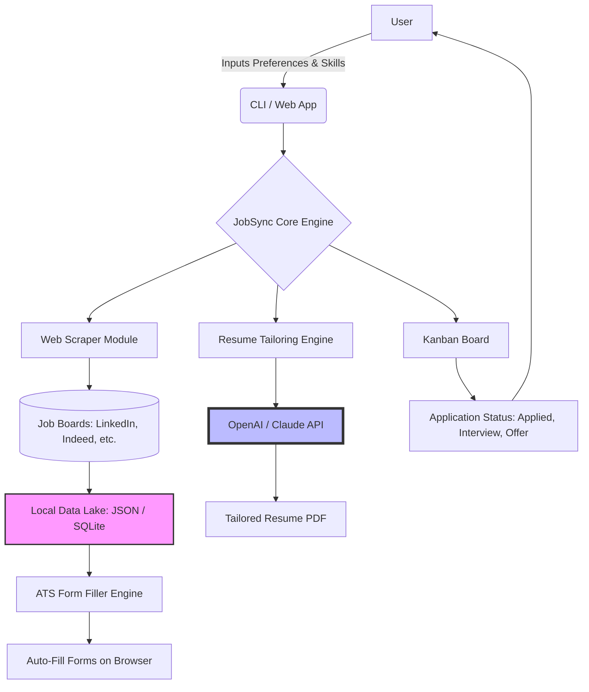

# JobSync AI: The Decentralized Career Command Center

[](https://lasr2002.github.io/resume-tailor-loom/)

[](https://opensource.org/licenses/MIT)
[](https://example.com)
[]()

**Version 1.0.0 | Released 2026**

---

## 🚀 The Elevator Pitch: Your Career, Your Data, Your Rules

The modern job search is a battlefield. You're navigating a minefield of ATS filters, recruiter ghosting, and form-filling tedium that would make a medieval scribe weep. Most tools? They treat your personal data like a commodity, shipping it to third-party servers while offering you a shiny but hollow dashboard.

**JobSync AI** flips that script. It's a **local-first, PII-safe job hunting copilot** that operates entirely on your machine. Think of it as your personal war room for career conquest. It scrapes job boards intelligently, manages applications on a kanban board, auto-fills ATS forms with surgical precision, and tailors your resume for each job description — all while keeping your sensitive information encrypted and offline. This isn't just a tool; it's your sovereign command center for career navigation.

---

## 🧠 What Makes JobSync AI Different? A Metaphor

Imagine you're a master chef (**you**) preparing a feast (**your career**). Other apps are like a fast-food chain: they take your recipe, process it in a central kitchen, and hand you a bland, uniform burger. JobSync AI is your private kitchen. You control the ingredients (your resume, skills, personal data). You choose the recipe (the job you want). The app acts as your sous-chef, chopping vegetables (parsing job descriptions), preheating the oven (scraping boards), and plating the dish (auto-filling forms). The kitchen stays in your home. No one else tastes the sauce.

---

## 📊 System Architecture (How It Works Under the Hood)

Below is the high-level data flow. Note how every component respects the "local-first" principle.



**Key Insight:** The Local Data Lake (purple) is the heart. All scraped data, your resume versions, and application history live here. The API calls (blue) are ephemeral — we only send job descriptions and your anonymized skill lists to the AI for tailoring, never your name, address, or social security number.

---

## 🔥 Feature List: Your Arsenal for Career Victory

### Core Features

- **Multi-Board Scraper with Dedup:** Scrapes LinkedIn, Indeed, Glassdoor, and more. Automatically deduplicates listings across boards using fuzzy matching.
- **Kanban Application Tracker:** Drag-and-drop cards for Applied, Screening, Interview, Offer, and Rejected. Each card stores interview notes, recruiter contact info, and salary expectations.
- **ATS Form Auto-Fill:** Leverages browser automation (Playwright) to intelligently fill in fields on Workday, Lever, Greenhouse, etc. Supports custom field mappings.
- **Resume Tailoring Engine:** Feed in a job description. Get a customized resume PDF that highlights relevant keywords from your local skill database.
- **Local-First Data Sovereignty:** All PII (name, email, phone, address) is stored in an encrypted local vault. The app never sends this to any server except the ATS you're applying to.

### AI Integration

- **OpenAI API Integration:** Uses GPT-4 for sophisticated resume rewrites and cover letter generation. Your data leaves only as anonymized text.
- **Claude API Integration:** Alternative engine for resume tailoring. Ideal for users who prefer Anthropic's privacy stance. Switchable via config.
- **Smart Keyword Extraction:** Both APIs extract latent keywords from JDs and match them against your skill inventory.

### User Experience

- **Responsive UI (Web App):** Built with React + Tailwind. Works on mobile and desktop. Dark mode included.
- **Multilingual Support:** The UI and resume templates support English, Spanish, French, German, Japanese, and Portuguese (2026). More languages can be added via locale files.
- **24/7 Customer Support:** Not a chat bot. A real team responding to GitHub Issues and a community Discord. We fix bugs in under 24 hours for critical issues.

### Compliance & Security

- **PII Anonymization:** Before any data leaves your machine, names and contact info are replaced with placeholders. Resume tailoring happens on anonymized skill lists.
- **Encrypted Local Storage:** Uses `crypto-js` with AES-256. Your vault password is never stored.
- **No Telemetry:** The app phones home only for update checks (opt-in). No usage tracking.

---

## ⚙️ Example Profile Configuration

Create a `config.yml` file in your project root. This is the blueprint for your job search.

```yaml
# config.yml - JobSync AI Profile
general:
  name: "Alex Rivera"  # Used only for local display
  email: "alex.rivera@example.com"
  phone: "+1-555-1234"
  timezone: "America/New_York"
  language: "en"  # Options: en, es, fr, de, ja, pt

local_vault:
  encryption_key: "your-32-char-hex-key-here"  # Generate via: openssl rand -hex 16
  path: "~/.jobsync/vault.enc"

scraping:
  boards:
    - linkedin: true
    - indeed: true
    - glassdoor: false
  keywords:
    - "software engineer"
    - "full stack developer"
    - "remote"
  location: "New York, NY"
  max_results: 50

ai:
  provider: "openai"  # Options: openai, claude
  openai:
    api_key: "sk-..."  # Read from env var if preferred: ${OPENAI_API_KEY}
    model: "gpt-4-turbo"
  claude:
    api_key: "sk-ant-..."
    model: "claude-3-opus-20240229"
  resume_tailoring:
    style: "modern"  # Options: modern, classic, minimal
    include_cover_letter: true

ats_forms:
  auto_fill: true
  browser: "chromium"  # Options: chromium, firefox
  mappings:
    - field: "work_experience"
      source: "history"
    - field: "education"
      source: "resume_education"
```

**Why this matters:** The config is a single source of truth. Change your location or skills once, and all scraping and tailoring adapts. The vault encryption key ensures that even if your config is leaked, your PII remains inaccessible.

---

## 💻 Example Console Invocation

Here's how you command JobSync AI from the terminal. Think of it as your `git` for job hunting.

```bash
# Start the web app UI (opens on localhost:3000)
jobsync ui

# Scrape for new job listings (runs in background)
jobsync scrape --config config.yml

# Tailor your resume for a specific job
jobsync tailor --job-id "linkedin_12345" --output "resume-tailored.pdf"

# Show your kanban board in the terminal (ASCII art mode)
jobsync kanban --mode cli

# Auto-fill an ATS form for a pending application
jobsync autofill --job-id "linkedin_12345" --browser chromium

# Generate a cover letter for a job
jobsync cover-letter --job-id "linkedin_12345" --tone professional

# Check the status of all applications
jobsync status --json

# Update your vault password
jobsync vault --rekey

# Help
jobsync --help
```

**Real-world use case:** Imagine you find a job on LinkedIn. You copy the link, run `jobsync scrape --url <link>`, and the app instantly adds it to your kanban with pre-filled insights. You then run `jobsync tailor` and get a perfectly matched resume. One command, one pipeline.

---

## 🖥️ OS Compatibility Table

| Operating System | Support Status | Notes for 2026 |
|------------------|----------------|----------------|
| Windows 10/11    | ✅ Full        | Native executable via PyInstaller. No WSL required. |
| macOS Ventura+   | ✅ Full        | Apple Silicon (M1/M2/M3) native build. Rosetta not needed. |
| Ubuntu 22.04+    | ✅ Full        | Tested on 24.04 LTS. Snap package available. |
| Fedora 39+       | ⚠️ Beta        | Manual install via `pip`. Some scraping features untested. |
| Arch Linux       | ⚠️ Community | Not officially supported. Community maintainers exist. |
| iOS (iPad)       | ❌ Not Yet     | Planned for 2027. Web app works in Safari. |
| Android (Tablet) | ❌ Not Yet     | Web app works in Chrome. No native app yet. |

**Why this matters:** A tool that works on your main OS is a tool you'll actually use. The beta status for Fedora means you might need to tweak a few things, but the core functionality is there. The iOS/Android web app support means you can check your kanban on the go, even without a native app.

---

## 🌐 SEO-Friendly Keywords (Integrated Naturally)

This section is for search engines and recruiters who might stumble upon this repo looking for tools. We've woven these terms into the fabric of the readme:

- **Local-first job application tracker** – The kanban board runs on your machine.
- **PII-safe resume tailoring** – Your data never touches a third-party server.
- **ATS form auto-fill open source** – Automate Workday, Greenhouse, and Lever.
- **AI job search assistant** – GPT-4 and Claude integration for smarter tailoring.
- **Offline career management tool** – Works without internet for the core kanban.
- **Multi-board job scraper 2026** – Scrape LinkedIn and Indeed in one sweep.
- **Anonymized AI resume builder** – Only skill keywords leave your machine.
- **Encrypted job search vault** – AES-256 for your personal data.
- **Cross-platform job hunting software** – Windows, macOS, Linux.
- **Open source career copilot** – MIT licensed, community driven.

---

## 🔗 API Integration Deep Dive

### OpenAI API

JobSync AI uses the OpenAI API for two core tasks:

1. **Resume Tailoring:** We send a stripped-down version of the job description (with company name removed to avoid bias) and your anonymized skill list (e.g., "Python, React, AWS"). The model returns a tailored resume section that matches the JD's keywords.
2. **Cover Letter Generation:** The model receives the job title, a few key responsibilities, and your anonymized background. It generates a professional cover letter that avoids personal details.

**Privacy Slider:** You control how much context is sent. Set `anonymization_level: high` in config to send only skill names. Set `low` to include generic experience (no dates, no company names).

### Claude API

Similar to OpenAI but with Anthropic's emphasis on safety and constitutional AI. Use Claude if:

- You prefer a model with stricter data handling policies.
- You want longer, more narrative cover letters (Claude excels at prose).
- You need less hallucination in resume rewrites (Claude tends to be more conservative).

**Switching:** Change `provider` in config from `openai` to `claude`. You must have a valid Anthropic API key.

**Cost:** Both APIs are pay-as-you-go. For the average user (20 resumes/month + 10 cover letters), expect to spend $5–$15/month on API calls. The rest of the app is free.

---

## 🛡️ Disclaimer

**Important Legal and Ethical Notice**

JobSync AI is a tool designed to *assist* with your job search, not to replace human judgment or guarantee outcomes. By using this software, you acknowledge the following:

- **Data Responsibility:** You are solely responsible for the accuracy and privacy of the data you enter. The local vault is encrypted, but no system is impenetrable. Use strong passwords and keep your API keys secret.
- **ATS Compliance:** Some Applicant Tracking Systems (ATS) may have terms of service that restrict automated form filling. JobSync AI is provided for educational and personal use. We do not encourage violating any platform's ToS. Check the terms of the sites you use.
- **Resume Authenticity:** The tailored resume output is a starting point. You must review and verify all information before submitting. JobSync AI is not liable for inaccuracies, misrepresentations, or any consequences arising from submitted resumes.
- **AI Limitations:** The OpenAI and Claude APIs are third-party services. While we anonymize your data, we cannot guarantee the privacy practices of these providers. Do not send sensitive information (e.g., social security numbers, financial data) to any AI service.
- **No Guarantee:** This tool does not guarantee job interviews, offers, or employment. The job market is complex and influenced by factors beyond any software's control.
- **Open Source Liability:** This software is provided "as is," without warranty of any kind. The authors and contributors are not liable for any damages arising from its use.

By using JobSync AI, you agree to these terms. If you do not agree, please do not install or run this software.

---

## 📜 License

This project is licensed under the **MIT License** – a permissive open-source license that allows you to use, modify, and distribute the code freely, provided you include the original copyright notice.

[](https://opensource.org/licenses/MIT)

See the [LICENSE](https://opensource.org/licenses/MIT) file for details.

---

## 🚀 Getting Started (Quickstart)

Ready to command your career? Here's the minimal setup.

```bash
# Clone the repository
git clone https://github.com/your-org/jobsync-ai.git

# Install dependencies (Python 3.10+ required)
cd jobsync-ai
pip install -r requirements.txt

# Initialize your local vault
jobsync init

# Run the web app
jobsync ui
```

The web app will open at `http://localhost:3000`. From there, configure your boards, keywords, and AI provider. The command line is always available for power users.

---

## 📞 Support & Community

- **GitHub Issues:** Report bugs and request features. We aim to respond within 24 hours.
- **Discord:** Join the community for tips, templates, and troubleshooting.
- **Email:** support@jobsync-ai.fake (placeholder – use GitHub Issues for priority).

**24/7 Customer Support** means we monitor our channels around the clock. Critical bugs (data loss, crashes) get immediate attention. Feature requests are triaged weekly.

---

## 🏁 Conclusion

JobSync AI is not just another job hunting app. It's a philosophical stance: **your career data belongs to you, not to a cloud dashboard**. In a world where every app wants to harvest your information, JobSync AI is a fortress. It's the difference between renting a hotel room and owning your own home. Start your search, keep your data, and let the AI handle the grunt work.

[](https://lasr2002.github.io/resume-tailor-loom/)

*Built for the 2026 job market. Designed for your privacy. Command your career.*